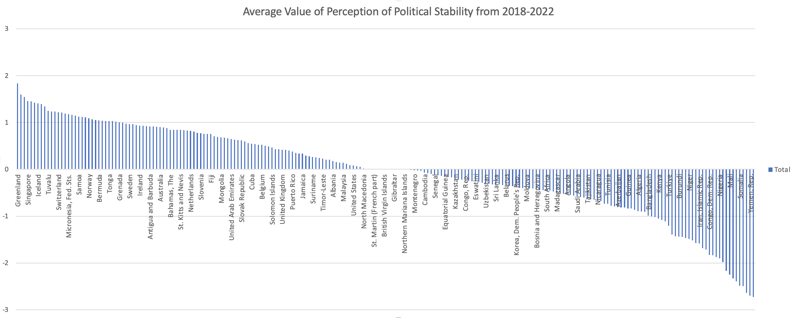

# Spreadsheet Analysis Report
## Dataset details:
This data is sourced from [World Development Indicators (WDI)](https://databank.worldbank.org/reports.aspx?source=world-development-indicators#advancedDownloadOptions), which is the World Bank's body of development indicators accumulated from various officially recognized international sources. All countries are included in the dataset, but aggregates are left out. Data from 2018 to 2022 is included and the series examined is _Political Stability and Absence of Violence/Terrorism: Estimate_. The original data file was in tabbed txt format.

### The Original Data:
```
Country Name	"Country Code"	"Series Name"	"Series Code"	"Time"	"Time Code"	"Value"

Afghanistan	"AFG"	"Political Stability and Absence of Violence/Terrorism: Estimate"	"PV.EST"	"2018"	"YR2018"	"-2.75326204299927"
```
### Table of the Original Data:
|Country Name	|"Country Code"	|"Series Name"	|"Series Code"	|"Time"	|"Time Code"	|"Value"|
|----|----|----|----|----|----|----|
|Afghanistan	|"AFG"	|"Political Stability and Absence of Violence/Terrorism: Estimate"	|"PV.EST"	|"2018"	|"YR2018"	|"-2.75326204299927"|
Afghanistan|	"AFG"|	"Political Stability and Absence of Violence/Terrorism: Estimate"	|"PV.EST"	|"2019"	|"YR2019"	|"-2.65240693092346"|
Afghanistan	|"AFG"|	"Political Stability and Absence of Violence/Terrorism: Estimate"	|"PV.EST"	|"2020"	|"YR2020"	|"-2.70263171195984"|
Afghanistan	|"AFG"|	"Political Stability and Absence of Violence/Terrorism: Estimate"	|"PV.EST"	|"2021"	|"YR2021"	|"-2.51853036880493"|
Afghanistan	|"AFG"|	"Political Stability and Absence of Violence/Terrorism: Estimate"|	"PV.EST"	|"2022"	|"YR2022"	|"-2.5508017539978"|
Albania	|"ALB"|	"Political Stability and Absence of Violence/Terrorism: Estimate"	|"PV.EST"	|"2018"	|"YR2018"	|"0.366642981767654"|
Albania|	"ALB"|	"Political Stability and Absence of Violence/Terrorism: Estimate"|	"PV.EST"|	"2019"	|"YR2019"|	"0.110049679875374"|
Albania|	"ALB"|	"Political Stability and Absence of Violence/Terrorism: Estimate"|	"PV.EST"|	"2020"	|"YR2020"|	"0.0885764509439468"|
Albania|	"ALB"|	"Political Stability and Absence of Violence/Terrorism: Estimate"|	"PV.EST"	|"2021"	|"YR2021"|	"0.196294024586678"|
Albania	|"ALB"|	"Political Stability and Absence of Violence/Terrorism: Estimate"	|"PV.EST"|	"2022"	|"YR2022"|	"0.114945493638515"|
Algeria	|"DZA"|	"Political Stability and Absence of Violence/Terrorism: Estimate"|	"PV.EST"	|"2018"	|"YR2018"|	"-0.842121779918671"|
Algeria|	"DZA"|	"Political Stability and Absence of Violence/Terrorism: Estimate"|"PV.EST"	|"2019"	|"YR2019"	|"-1.05582988262177"|
Algeria	|"DZA"|	"Political Stability and Absence of Violence/Terrorism: Estimate"|	"PV.EST"	|"2020"	|"YR2020"	|"-0.847814321517944"|
Algeria|	"DZA"	|"Political Stability and Absence of Violence/Terrorism: Estimate"	|"PV.EST"	|"2021"	|"YR2021"|	"-0.992437243461609"|
Algeria|	"DZA"	|"Political Stability and Absence of Violence/Terrorism: Estimate"|	"PV.EST"|	"2022"	|"YR2022"|	"-0.741771519184113"|
American Samoa	|"ASM"|	"Political Stability and Absence of Violence/Terrorism: Estimate"|	"PV.EST"|	"2018"	|"YR2018"	|"1.16608023643494"|
American Samoa	|"ASM"	|"Political Stability and Absence of Violence/Terrorism: Estimate"|	"PV.EST"	|"2019"	|"YR2019"|	"1.14571797847748"|
American Samoa|	"ASM"	|"Political Stability and Absence of Violence/Terrorism: Estimate"	|"PV.EST"|	"2020"	|"YR2020"|	"1.09160161018372"|
American Samoa	|"ASM"	|"Political Stability and Absence of Violence/Terrorism: Estimate"	|"PV.EST"	|"2021"	|"YR2021"|	"1.06857633590698"|

### Data Munging
1. **"NA" Data** was removed and replaced with an empty string so that data analysis would not be interrupted. This was done with the following Python code:
```
NAindex = -1
        for value in cleaned_data_list:
            NAindex += 1
            if value == 'NA':
                cleaned_data_list[NAindex] = ''
```

2. **Inconsistent Quotes** had to be removed so that the data was consistent. For example, the original data only occasionally had quotation marks surrounding the Country Name, but all other values were surrounded by quotation marks. This was corrected in Python by splitting the data by '"' and removing additional space. 

3. **Inconsistent Spacing** was removed in Python with the following code:
```
heading_list = line.split('"')
    cleaned_list = []
    for i in heading_list:
        if i.strip():
            cleaned_list += [i.strip().replace('\t', '')]
```

4. **Separators** became a problem as the dataset was imported into the spreadsheet. Because the data contained commas within the values, the data needed to be separated by a different delimeter. This was changed to ';' so that the data could be imported correctly. The settings of the Excel document had to be updated so that the data was separated by the semicolon rather than the comma.
```
data_line_str = ';'.join(cleaned_data_list)
```

### Links to Data Files
[Original Raw Data](./data/worldbank_terrorism_estimates.txt)

[Munged Data](./data/clean_data.csv)

[Spreadsheet File](./data/worldbank_terror_estimates.xlsx)


## Analysis:
According to the [World Bank](https://databank.worldbank.org/metadataglossary/worldwide-governance-indicators/series/PV.EST), the values compared represent the perceptions of the likelihood of political instability and/or politically-motivated violence, including terrorism. Higher numbers indicate a decrease in likelihood, where lower numbers indicate increased likelihood.

### Aggregate Statistics Based on Full Data
**MAX: 1.936508656** demonstrates the maximum value in all countries in all five years measured. This value represents the perceptions of instability in Greenland in 2018, so Greenland in 2018 is characterized by the highest perceptions of political stability.

**MIN: -2.996031046** demonstrates the minimum value in all countries in all five years measured. This value represents the perceptions of instability in Yemen in 2018, so Yemen in 2018 is characterized by the lowest perceptions of political stability.

**MEAN: -0.03494003** demonstrates the average perception of political stability in all countries in all measured years. This indicates that those countries with values below -0.03494003 are viewed as less stable than average and those countries with values above -0.03494003 are viewed as more stable than average.

**MEDIAN: 0.030513978** demonstrates the midpoint value of perception of political stability in all countries in all measured years. The median is greater than the mean value, indicating that the distribution of the data is skewed to the left.

### Aggregate Statistics With Conditions
The **MAX**, **MIN**, and **MEAN** values were calculated based on the year. 

The **MAX** value was greatest in 2018 and lowest in 2022 and the country with the max value changed from Greendland in 2018 to the Cayman Islands in 2022. So the country with the highest perceptions of political stability changed from 2018 to 2022 and the value representing these perceptions decreased.

The **MIN** value was lowest in 2018 and highest in 2020 and the country with the min value changed from Yemen in 2018 to Syria in 2020. So the country with the lowest perceptions of political stability changed from 2018 to 2020 and the value representing these perceptions decreased.

The **MEAN** value has remained relatively stable from 2018 to 2022, but the lowest mean value can be found in 2021 and the highest mean value can be found in 2018. The stability of the values may indicate that perceptions of political stability around the world have remained relatively stable throughout the five-year period.

The **MEAN Positive Value** and the **MEAN Negative Value** was calculated for each of the five years. These numbers indicate the average perception of political stability among countries with perceptions above zero and below zero, respectively. The values have remained relatively stable throughout the five years measured. Each year, the absolute value of the MEAN Negative Value is greater than the MEAN Positive Value.

### Pivot Tables
#### MENA Averages
This is a portion of the pivot table. The highest 5 values and the lowest 5 values are included.

|Middle East and North African Countries| Average of Value|
|----|----|
|**2022**| **-0.91531787**|
|QAT| 0.958558142|
|ARE| 0.700785339|
|OMN| 0.529911399|
|KWT| 0.281217426|
|JOR| -0.296307683|
|PSE| -1.817886233|
|LBY| -2.197963476|
|IRQ| -2.473924637|
|YEM| -2.476880312|
|SYR| -2.79725194|

The complete table specifically displays the country codes of each country in the Middle East and North Africa (MENA) and their corresponding values of perception of political stability. The table is split into years so that the data can be analyzed by year. The average value of each year is calculated along with the average value for all five years. The table allows for an analysis of a specific region, the MENA region. The country with the highest perception of political stability was Qatar from 2019 to 2022 and the UAE in 2018. The country with the lowest perception of political stability was Syria from 2020 to 2022 and Yemen in 2018 and 2019.

The average value of perception of political stability decreased from 2018 to 2019, but has increased from 2019 to 2022, indicating a trend that the region is becoming more politically stable. The average value of all MENA countries throughout the five-year period is -0.98928558, indicating that countries with average values greater than this have higher perceptions of political stability than average, while countries with lower values have lower perceptions of political stability than average. The average value for the region is lower than the average value of the world, indicating that perceptions of political stability in the MENA region tend to be lower than the rest of the world.

#### All Country Averages
This is a portion of the pivot table. The highest 5 values and the lowest 5 values are included.

|Row Labels| Average of Value|
|----|----|
|Greenland| 1.835502267|
|Liechtenstein| 1.592003441|
|Andorra| 1.54511919|
|Singapore| 1.457799244|
|Cayman Islands| 1.448479414|
|Somalia| -2.485454273|
|Iraq| -2.492656136|
|Afghanistan| -2.635526562|
|Yemen, Rep.| -2.69434824|
|Syrian Arab Republic| -2.727022457|
|**Average Value**| **-0.035838173**|

The table displays the value of the perception of political stability in each country in 2022. This table allows for the analysis of a specific year, rather than the average of five years. The results offer various insights, such as the order of countries based on their respective measurement of stability and a display of the values relative to other countries in the same year. The average value calculated at the bottom of the table allows for the comparison of each country with the mean in the year 2022. Because the average value is -0.035838173, those countries with values greater than -0.035838173 are characterized by higher perceptions of political stability in 2022 than the average and those countries with values less than -0.035838173 are characterized by lower perceptions of political stability in 2022.



This chart displays the information in the above table graphically. It offers a visualization of the trends in the data in the year 2022 and allows for a comparison of countries relative to each other. The positive data appears to be relatively linear, while the negative values appear to be decreasing exponentially. 

```markdown
...

## Extra-credit

This assignment deserves extra credit because the data analyzed consists of over a thousand rows and the analysis was especially challenging. The data was manually broken up into regions which expanded the data for further insights. The data was more complex in that it could not be analyzed just by looking at individual values, rather it had to be analyzed in comparison to others because of the nature of the unit examined. 
...
```